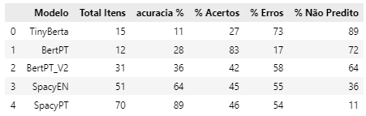

# RESPOSTAS ao TP4
## Projeto Disponível em: [https://github.com/rodrigo1992-cmyk/PB_TP_X/tree/PB_TP4](https://github.com/rodrigo1992-cmyk/PB_TP_X/blob/PT_TP4/)
## Para visualizar no Streamlit, executar arquivo "app\pages\app_streamlit.py"
## Para subir o servidor com uvicorn, executar o arquivo "app\services\main_backend.py"

# 1. Identificação e Escolha do Modelo LLM (Local):
### **Critérios de Seleção**: Pesquise e selecione o modelo de linguagem natural mais adequado para a sua aplicação, considerando os seguintes critérios:
* **Desempenho**: Avalie a precisão, a capacidade de resposta e o tipo de tarefa para a qual o modelo foi treinado (ex: GPT, BERT, T5).
* **Custo Computacional Local**: Verifique os recursos de hardware necessários para rodar o modelo no ambiente local (como GPU, memória RAM, etc.).
* **Acessibilidade Local**: Garanta que o modelo escolhido pode ser carregado localmente, utilizando bibliotecas como Transformers da HuggingFace para download e execução do modelo em sua própria máquina.
* **Documentação**: Justifique a escolha do modelo, detalhando os critérios de desempenho, custo computacional local e acessibilidade que levaram à sua decisão.

> O Sistema usará Modelos de LLM para duas aplicações diferentes, extração de entidades nomeadas (NER) das descrições de vagas, para criação de uma base de dados de requisitos, que será utilizada em filtros e gráficos. (Substituindo a base criada manualmente no TP2) e outro modelo que servirá de motor de busca via chat, retornando as vagas mais parecidas com a descrição inputada pelo usuários. Abaixo serão abordados os critérios para seleção dos dois modelos.

> ### Modelo 1 (Extração de Entidades)
> Foram avaliadas 5 abordagens distintas (testes disponíveis no arquivo LLM_Requistos.ipynb), utilizando as descrições de 4 vagas (de forma recursiva), e comparando o resultado de cada modelo com um "conjunto verdade" construído manualmente, que continha as entidades desejadas. Os testes foram realizados em um notebook sem GPU e com apenas 8Gb de RAM. Foram realizados textes com diversos "contextos" distintos nos modelos, porém em todos os casos os modelos listam palavras além do desejado. No final foi definido como Contexto a frase "Quais softwares e tecnologias são mencionados no texto?":

> * **TINYROBERT-SQUAD2**: Modelo leve, com 81.5Mi de parâmetros e <1Gb. Este é um modelo de Question-Answer e teve bom tempo de reposta.   
>   * **PROS**: 
>     * Compreendeu o prompt adequadamente, distinguindo bem o que eram softwares.
>     * Tempo de resposta adequado.  
>   * **CONS**:
>     * Retornou palavras que não eram softwares. Ao pedir "Softwares e Tecnologias" passou a trazer muitos resultados incoerentes.
>     * Modelo em inglês. As descrições das vagas estão em português, então seria necessária a tradução prévia, podendo gerar  inconsistências adicionais.
>     * Extrai apenas a primeira resposta encontrada dentro do texto. Apesar de responder corretamente caso vários softwares sejam citados dentro da mesma frase, não obtem as correspondência das frases seguintes, caso haja.   

> * **BERT-BASE-CASED-SQUAD-V1.1-PORTUGUESE**: Modelo leve, com 110Mi de parâmetros e aproximadamente 1.5Gb. Este é um Fine-Tunning do  do modelo bert-uncased, adequando para tarefas de QA em textos em português.
>   * **PROS**: 
>     * Compreendeu o prompt adequadamente, distinguindo bem o que eram softwares.
>     * Modelo em portugês, dispensando a tradução dos inputs. 
>     * Tempo de resposta adequado.  
>   * **CONS**:
>     * Retornou palavras que não eram softwares. Ao pedir "Softwares e Tecnologias" passou a trazer muitos resultados incoerentes.
>     * Assim como o TINYROBERT, extrai apenas a primeira resposta encontrada dentro do texto.   

> * **BERT-BASE-CASED-SQUAD-V1.1-PORTUGUESE (ABORDAGEM ALTERNATIVA)**: Como o modelo retornava apenas a primeira correspondência, foi testada uma abordagem passando uma frase por vez para o modelo, e no final feito um filtro para retirar correspondências de baixo score.
>   * **PROS**: 
>     * Conseguiu identificar um número bem maior de correspondências  
>   * **CONS**:
>     * Caso na frase não haja o nome de nenhum software, o modelo retorna qualquer palavra. Este tipo de modelo sempre retorna algum resultado, mesmo que não seja a resposta que era pretendida, pois é feita uma correspondência é estatística. Para minimizar os erros, após a consolidação de todas as respostas, foi feito um filtro para descarte das com Score baixo.    

> * **SPACY EN_CORE_WEB_LG**: Um modelo de NLP específico para NER (Extração de entidades nomeadas). É uma abordagem mais eficiênte, com o melhor tempo de resposta dentre todos os testes.
>   * **PROS**: 
>     * Conseguiu identificar um número bem maior de correspondências.  
>     * A maior parte das tecnologias/softwares são classificados como uma entidade do tipo ORG, facilitando o filtro para manter somente o desejado.  
>   * **CONS**:
>     * Necessita tradução do input para inglês.
>     * Não extrai apenas tecnologias/softwares, mas qualquer entidade do tipo ORG.   

> * **SPACY PT_CORE_NEWS_LG**: Modelo de NLP também da SPACY, porém em portugês. Foi o modelo escolhido para implementação, pois obteve maior pontuação em todas as métricas na comparação entre o conjunto de termos respondidos vs termos do "conjunto verdade".
>   * **PROS**: 
>     * Foi o modelo que mais capturou correspondências.  
>     * Obteve a melhor pontuação nos testes.
>     * Dispensa tradução do input.
>   * **CONS**:
>     * Os nomes de softwares não estão corretamente classificados como "ORG", impossibilitando um filtro como foi feito na versão em inglês. Entretanto, como os nomes de quase todos os softwares e tecnologias são em inglês, o modelo conseguiu capturar facilmente que se tratam de entidades.   

> Abaixo se encontram as pontuações de cada modelo:  
>   
> ***legenda***:
> * *Total de Itens: Total de termos extraídos por cada modelo.*
> * *Acurácia %: Percentual de acertos em relação o total de termos contidos no "conjunto verdade".*
> * *% Acertos : Percentual de acertos em relação o total de termos contidos nas respostas.*
> * *% Erros : Percentual de erros em relação o total de termos contidos nas respostas.*
> * *% Não Preditos : Percentual de termos do "conjunto verdade" que não estavam contidos na resposta.*

> ### Modelo 2 (Chat de Buscas):
> Foram testados 3 modelos, "all-MiniLM-L6-multilingual-v2-en-es-pt-pt-br" (22.7Mi parâmetros), "paraphrase-multilingual-MiniLM-L12-v2" (33.4M) e sentence-transformers/all-mpnet-base-v2 (109Mi). Todos os modelos são leves, com tamanho inferior a 1Gb. Também tiveram excelente tempo de resposta, variando entre 1.7s e 2.5s, sendo o modelo L6 o mais rápido, com 1.7s para realizar os 3 testes. Não foram utilizadas métricas, apenas observados os resultados gerados pelos modelos a partir de 3 buscas distintas:
> * "Cientista de dados com domínio de Python. Desejável experiência com criação de visualizações utilizando Matplotlib, Seaborn ou Plotly".
> * "Analista de dados. Atuar com levantamento de requisitos, desenvolvimento de dashboards em Power BI e acompanhamento de KPIs".
> * "Analista de dados. Excel Avançado. Formação em administração ou contabilidade."
>   
> Após a leitura dos resultados obtidos para cada busca, foi escolhido o modelo all-mpnet-base-v2 para o projeto, pois apesar de ser o modelo com mais parâmetros mostrou um bom tempo de resposta, com 2.1s para realizar as 3 buscas. Os resultados obtidos por este moodelo também pareceram estar mais coerentes com as frases inputadas para busca.

# 2.Integração de LLM com FastAPI no Ambiente Local:
* **Execução Local**: Utilize um modelo da HuggingFace ou um modelo treinado localmente para realizar tarefas de processamento de linguagem natural (como geração de texto, resumo automático, classificação de sentimento, etc.) e integre-o ao seu backend FastAPI, sem necessidade de conexão com a nuvem.
* **Rota FastAPI**: Implemente uma rota em FastAPI que se conecte ao modelo LLM rodando localmente para processar dados textuais fornecidos pela aplicação. Exemplo de rota:
* **POST /processar_texto**: Rota que recebe um texto enviado pelo usuário e retorna a análise ou processamento realizado pelo modelo de linguagem, como um resumo ou análise de sentimento.
Execução Local do HuggingFace: Baixe o modelo diretamente em seu ambiente de desenvolvimento local e utilize as funções da biblioteca Transformers para carregar e executar o modelo sem depender de serviços externos.

> Foi realizada a integração do Modelo para o Chat de Buscas, pois o modelo para Extração de Entidades Nomeadas é para execução pontual no backend, não sendo invocado pelo usuário. A chamada à API está no arquivo pages/utils.py e o modelo no arquivo routes/paths.py 
> Por enquanto o modelo está retornando os dados da vaga localizada no próprio chat, porém irei criar uma janela lateral para exibir o conteúdo da vaga de forma estruturada, de forma sincronizada com o chat. Caso não consiga, tentarei aprimorar a formatação das respostas via chat.

# 3.Manipulação das Respostas da API:
* **Response Models**: Crie Response Models em FastAPI para garantir que as respostas da API sejam consistentes e estruturadas, utilizando modelos de resposta claros e bem definidos.
  * Exemplo: A rota /processar_texto deve retornar um JSON estruturado com informações detalhadas, como o texto processado, o tipo de análise realizada (resumo, classificação, etc.) e os resultados gerados.
* **Validação das Respostas**: Assegure-se de que todos os retornos da API estejam validados, garantindo que os dados enviados e recebidos estejam no formato correto e sejam compreensíveis para o cliente.

> Response Models criadas e utilizadas para validação. Modelos em model/api_models.py

# 4. Tratamento Robusto de Erros na API:
* **Exceções HTTP**: Implemente um tratamento robusto de erros na API, utilizando exceções HTTP específicas em FastAPI para lidar com problemas que possam ocorrer durante as requisições (como falha ao carregar o modelo, problemas com os dados de entrada, ou timeouts).
  * Exemplo: Se o modelo LLM não estiver carregado corretamente ou ocorrer um erro na manipulação dos dados, a aplicação deve retornar um código de erro adequado (ex: 503 Serviço Indisponível) e uma mensagem explicativa.
* **Melhoria da Experiência do Usuário**: Garanta que os erros sejam tratados de forma clara e informativa, proporcionando feedback útil para o usuário final e facilitando o diagnóstico de possíveis problemas.

> Tratamento de erros implementado em todas as APIs, principalmente no chat com o LLM de Busca. Arquivo router/paths.py
