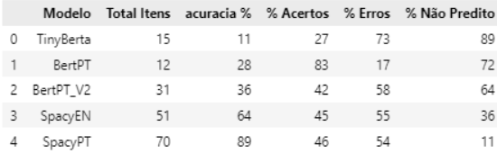

# MODEL REPORT

O Sistema utiliza Modelos de LLM para duas aplicações diferentes:
* Extração de entidades nomeadas (NER) das descrições de vagas, para criação de uma base de dados de requisitos, que será utilizada em filtros e gráficos (substituindo a base criada manualmente no TP2)
* Motor de busca via chat, retornando as vagas mais parecidas com a descrição inputada pelo usuários. Abaixo serão abordados os critérios para seleção dos dois modelos.

## Modelo 1 (Extração de Entidades)
Foram avaliadas 5 abordagens distintas (testes disponíveis no arquivo LLM_Requistos.ipynb), utilizando as descrições de 4 vagas (de forma recursiva), e comparando o resultado de cada modelo com um "conjunto verdade" construído manualmente, que continha as entidades desejadas. Os testes foram realizados em um notebook sem GPU e com apenas 8Gb de RAM. Foram realizados textes com diversos "contextos" distintos nos modelos, porém em todos os casos os modelos listam palavras além do desejado. No final foi definido como Contexto a frase "Quais softwares e tecnologias são mencionados no texto?":

> * **TINYROBERT-SQUAD2**: Modelo leve, com 81.5Mi de parâmetros e <1Gb. Este é um modelo de Question-Answer e teve bom tempo de reposta.   
>   * **PROS**: 
>     * Compreendeu o prompt adequadamente, distinguindo bem o que eram softwares.
>     * Tempo de resposta adequado.  
>   * **CONS**:
>     * Retornou palavras que não eram softwares. Ao pedir "Softwares e Tecnologias" passou a trazer muitos resultados incoerentes.
>     * Modelo em inglês. As descrições das vagas estão em português, então seria necessária a tradução prévia, podendo gerar  inconsistências adicionais.
>     * Extrai apenas a primeira resposta encontrada dentro do texto. Apesar de responder corretamente caso vários softwares sejam citados dentro da mesma frase, não obtem as correspondência das frases seguintes, caso haja.   

 

> * **BERT-BASE-CASED-SQUAD-V1.1-PORTUGUESE**: Modelo leve, com 110Mi de parâmetros e aproximadamente 1.5Gb. Este é um Fine-Tunning do  do modelo bert-uncased, adequando para tarefas de QA em textos em português.
>   * **PROS**: 
>     * Compreendeu o prompt adequadamente, distinguindo bem o que eram softwares.
>     * Modelo em portugês, dispensando a tradução dos inputs. 
>     * Tempo de resposta adequado.  
>   * **CONS**:
>     * Retornou palavras que não eram softwares. Ao pedir "Softwares e Tecnologias" passou a trazer muitos resultados incoerentes.
>     * Assim como o TINYROBERT, extrai apenas a primeira resposta encontrada dentro do texto.   

 

> * **BERT-BASE-CASED-SQUAD-V1.1-PORTUGUESE (ABORDAGEM ALTERNATIVA)**: Como o modelo retornava apenas a primeira correspondência, foi testada uma abordagem passando uma frase por vez para o modelo, e no final feito um filtro para retirar correspondências de baixo score.
>   * **PROS**: 
>     * Conseguiu identificar um número bem maior de correspondências  
>   * **CONS**:
>     * Caso na frase não haja o nome de nenhum software, o modelo retorna qualquer palavra. Este tipo de modelo sempre retorna algum resultado, mesmo que não seja a resposta que era pretendida, pois é feita uma correspondência é estatística. Para minimizar os erros, após a consolidação de todas as respostas, foi feito um filtro para descarte das com Score baixo.    

 

> * **SPACY EN_CORE_WEB_LG**: Um modelo de NLP específico para NER (Extração de entidades nomeadas). É uma abordagem mais eficiênte, com o melhor tempo de resposta dentre todos os testes.
>   * **PROS**: 
>     * Conseguiu identificar um número bem maior de correspondências.  
>     * A maior parte das tecnologias/softwares são classificados como uma entidade do tipo ORG, facilitando o filtro para manter somente o desejado.  
>   * **CONS**:
>     * Necessita tradução do input para inglês.
>     * Não extrai apenas tecnologias/softwares, mas qualquer entidade do tipo ORG.   

 

> * **SPACY PT_CORE_NEWS_LG**: Modelo de NLP também da SPACY, porém em portugês. Foi o modelo escolhido para implementação, pois obteve maior pontuação em todas as métricas na comparação entre o conjunto de termos respondidos vs termos do "conjunto verdade".
>   * **PROS**: 
>     * Foi o modelo que mais capturou correspondências.  
>     * Obteve a melhor pontuação nos testes.
>     * Dispensa tradução do input.
>   * **CONS**:
>     * Os nomes de softwares não estão corretamente classificados como "ORG", impossibilitando um filtro como foi feito na versão em inglês. Entretanto, como os nomes de quase todos os softwares e tecnologias são em inglês, o modelo conseguiu capturar facilmente que se tratam de entidades.   

 

> Abaixo se encontram as pontuações de cada modelo:  
>  
> ***legenda***:
> * *Total de Itens: Total de termos extraídos por cada modelo.*
> * *Acurácia %: Percentual de acertos em relação o total de termos contidos no "conjunto verdade".*
> * *% Acertos : Percentual de acertos em relação o total de termos contidos nas respostas.*
> * *% Erros : Percentual de erros em relação o total de termos contidos nas respostas.*
> * *% Não Preditos : Percentual de termos do "conjunto verdade" que não estavam contidos na resposta.*

## Modelo 2 (Chat de Buscas):
Foram testados 3 modelos, "all-MiniLM-L6-multilingual-v2-en-es-pt-pt-br" (22.7Mi parâmetros), "paraphrase-multilingual-MiniLM-L12-v2" (33.4M) e sentence-transformers/all-mpnet-base-v2 (109Mi). Todos os modelos são leves, com tamanho inferior a 1Gb. Também tiveram excelente tempo de resposta, variando entre 1.7s e 2.5s, sendo o modelo L6 o mais rápido, com 1.7s para realizar os 3 testes. Não foram utilizadas métricas, apenas observados os resultados gerados pelos modelos a partir de 3 buscas distintas:
* "Cientista de dados com domínio de Python. Desejável experiência com criação de visualizações utilizando Matplotlib, Seaborn ou Plotly".
* "Analista de dados. Atuar com levantamento de requisitos, desenvolvimento de dashboards em Power BI e acompanhamento de KPIs".
* "Analista de dados. Excel Avançado. Formação em administração ou contabilidade."
  
> Após a leitura dos resultados obtidos para cada busca, foi escolhido o modelo all-mpnet-base-v2 para o projeto, pois apesar de ser o modelo com mais parâmetros mostrou um bom tempo de resposta, com 2.1s para realizar as 3 buscas. Os resultados obtidos por este moodelo também pareceram estar mais coerentes com as frases inputadas para busca.
